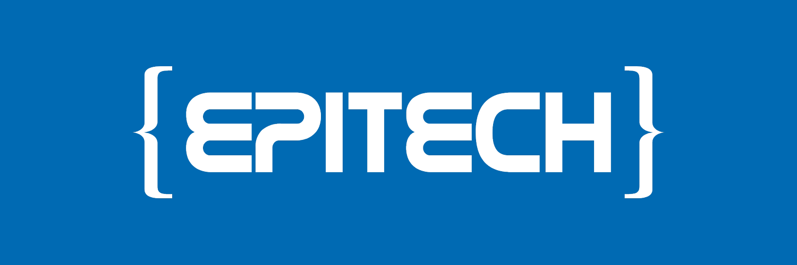

## Features  

🔥 The projects I liked working on  
🏆 The projects I'm proud of  
🔧 Nix flakes to build projects [TODO]  
📄 README.md files in each project [TODO]

## Structure

```
root
├── abstract-vm - A C++ virtual machine executing op-codes
├── arcade      - A C++ game engine that load game trough shared libraries
├── minishell   - A C minimalist shell implementation
├── myftp       - A C basic server implementation of the FTP protocol
├── myteams     - A C server mocking the features of teams (sending messages, list groups, etc...)
├── nasm        - A assembly little library with basic functions like (strcmp, strlen, etc...)
├── panoramix   - A C multi thread exercice simulating a village feeded by druids
├── pushswap    - A C exercice
└── zappy       - A full gui, backend & clients game simulating a little game named zappy
```
